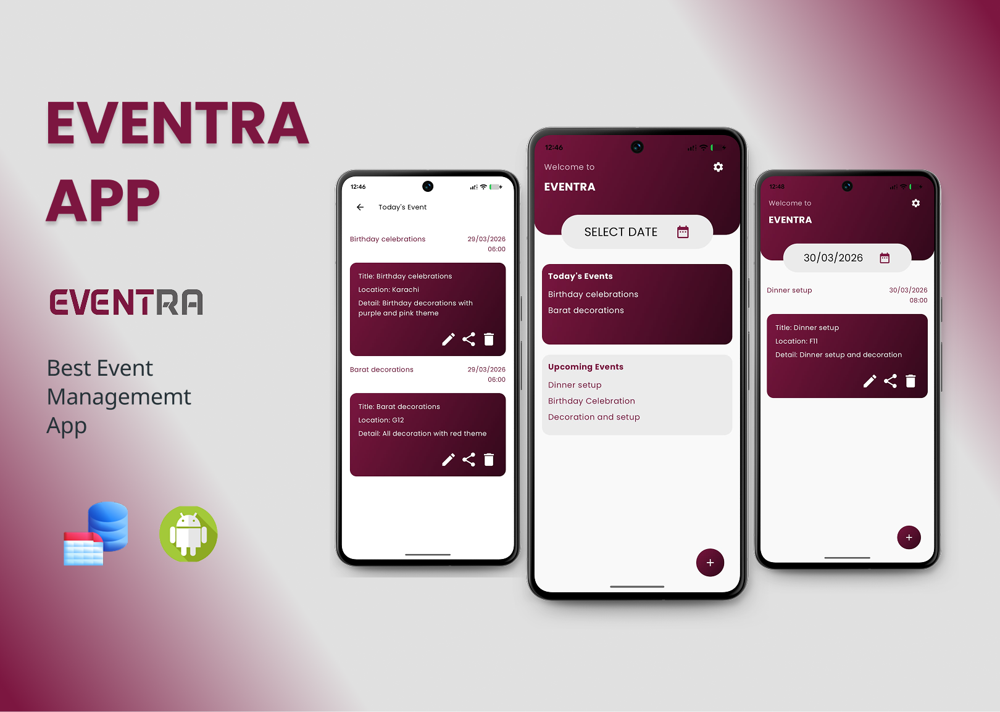
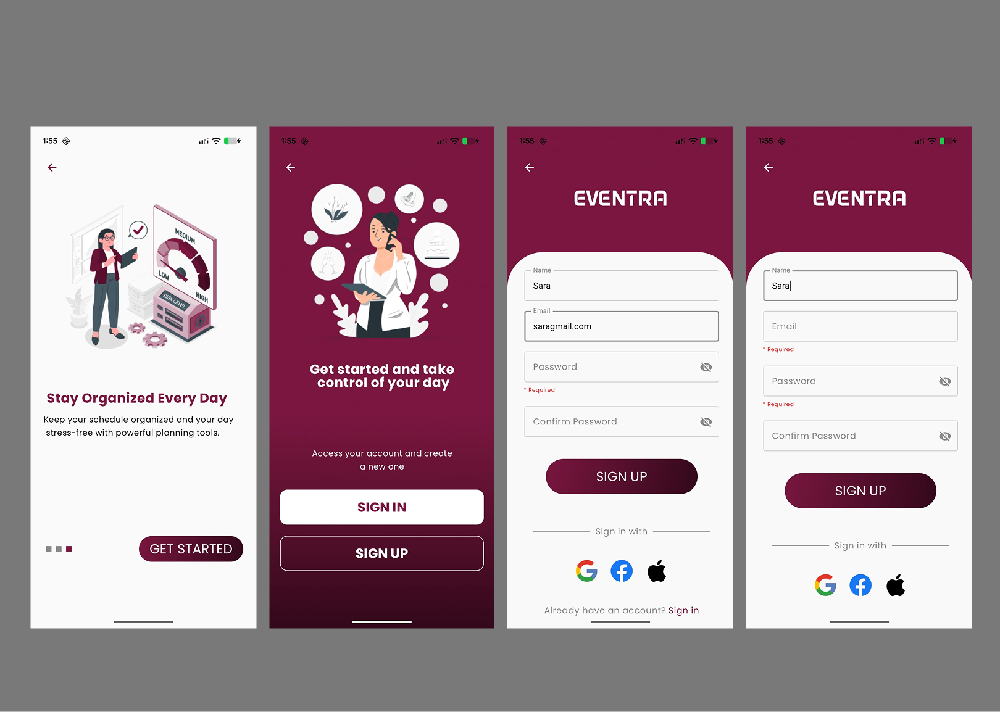
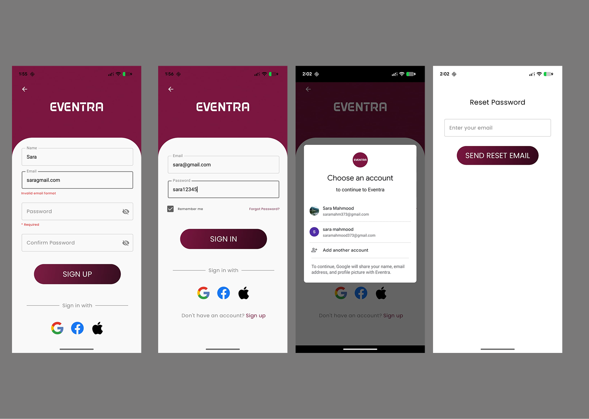
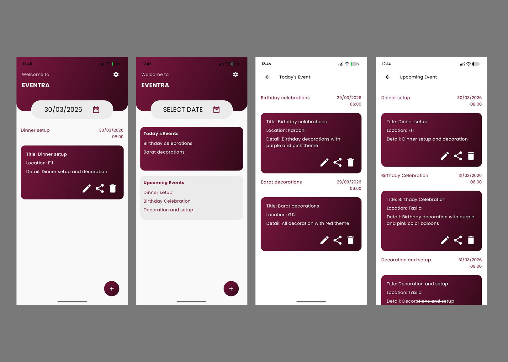
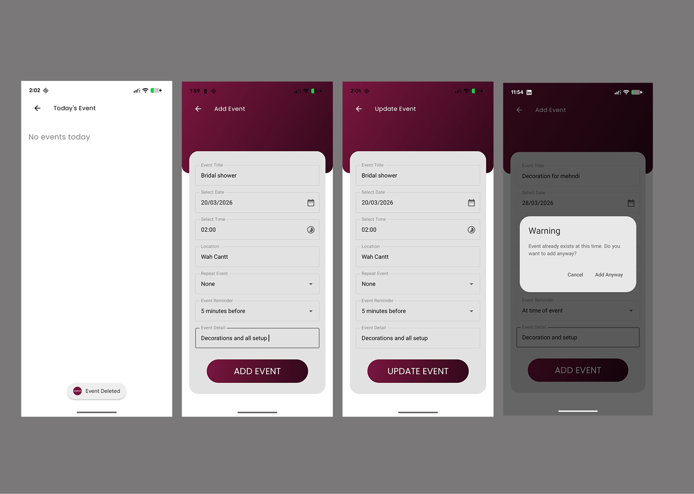
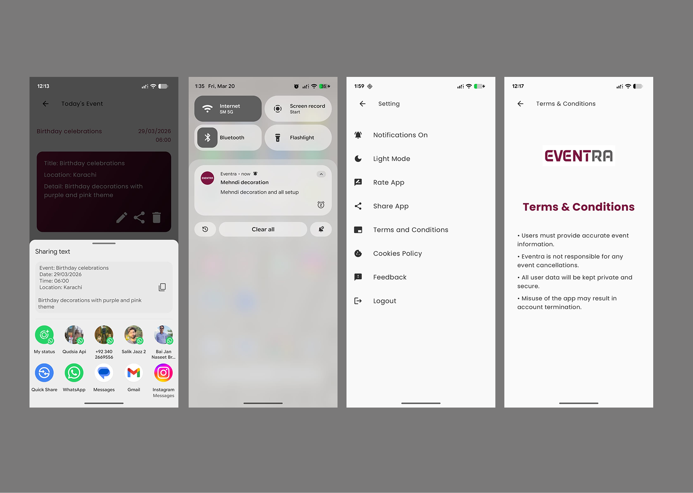
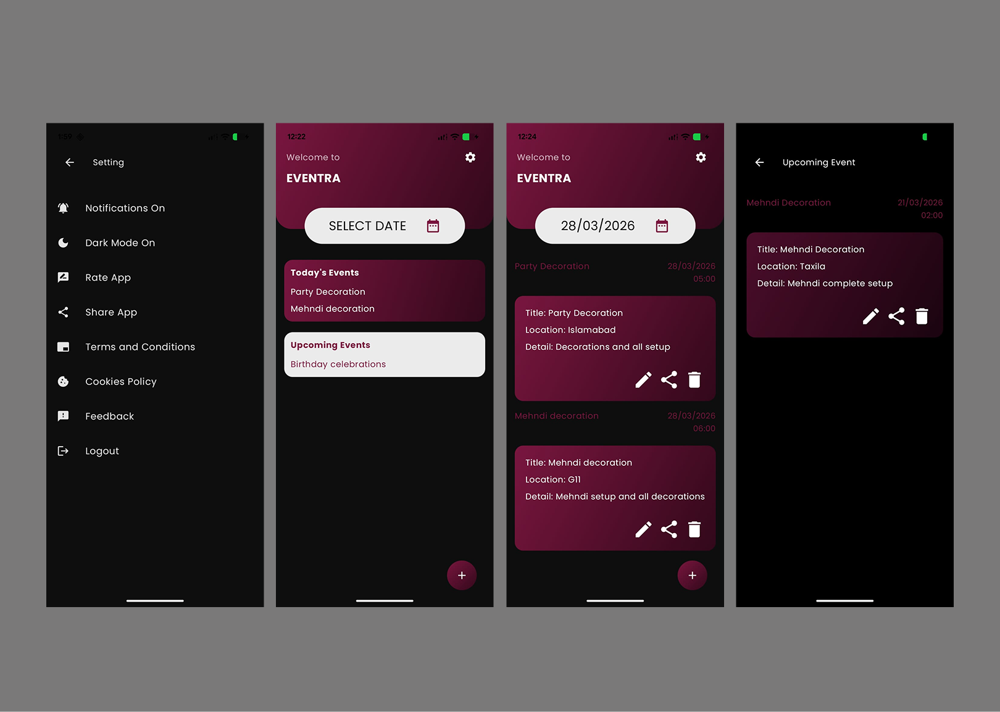

# 📱 Eventra App

Eventra is a modern and user-friendly **Event Management Android App** built using **Kotlin & Jetpack Compose**.  
It helps users manage events, set reminders, and stay organized in daily life.

---

## ✨ Features

- 📅 Create & manage events easily  
- 🔔 Smart reminders & notifications  
- 🎯 Clean and modern UI/UX  
- 🚀 Smooth onboarding experience  
- 🔐 Authentication (Sign In / Sign Up)  
- 🌙 Dark mode support  
- ⚙️ Settings & customization  

---

## 🛠 Tech Stack

- Kotlin  
- Jetpack Compose  
- MVVM Architecture  
- Navigation Component  
- SharedPreferences  

---

## 📸 Screenshots

<p align="center">
  
  
  
</p>

<p align="center">
  
  
  
</p>

<p align="center">
  
  
</p>

---

## 🎯 Purpose

This project showcases my skills in:
- Android Development 📱  
- UI/UX Design 🎨  
- Building real-world applications using Jetpack Compose 🚀  

---

## 🚀 Getting Started

1. Clone the repository  
   ```bash
   git clone https://github.com/sara12472/EventraApp/tree/master/app
